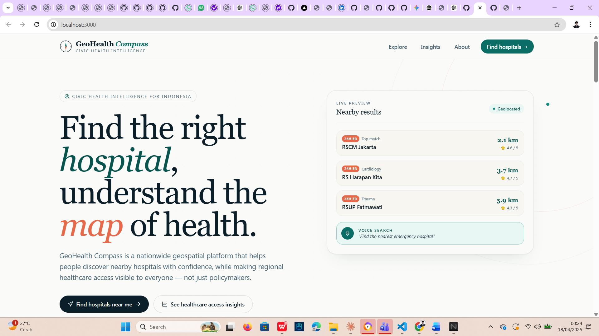
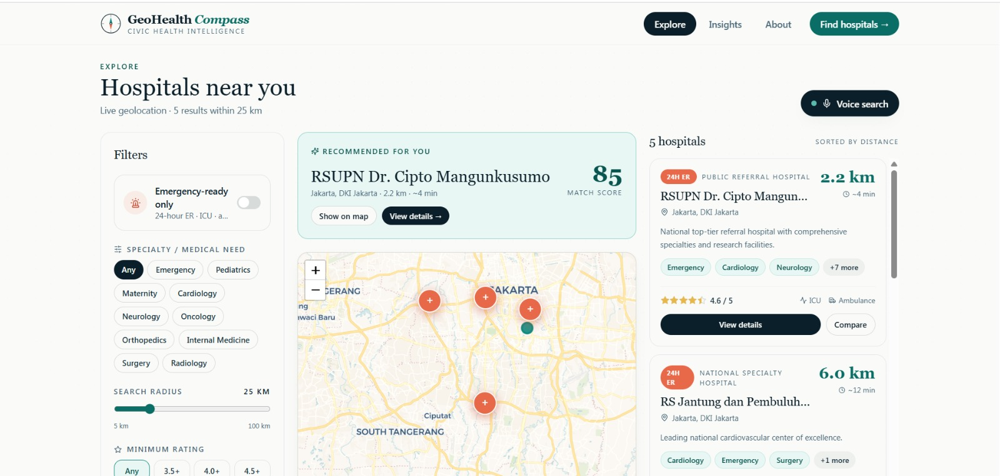
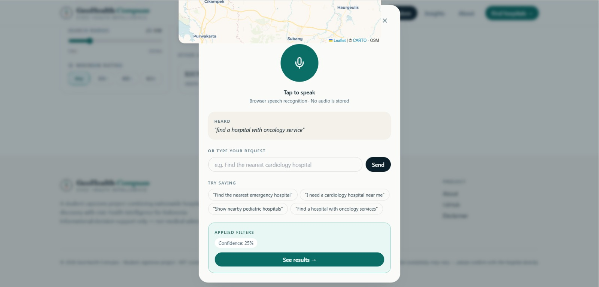
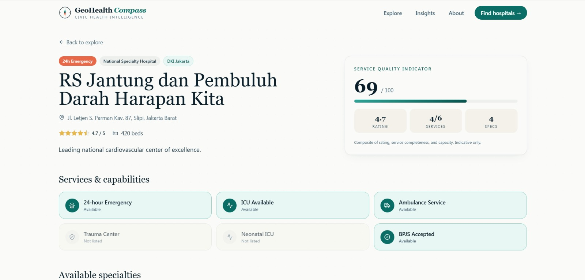
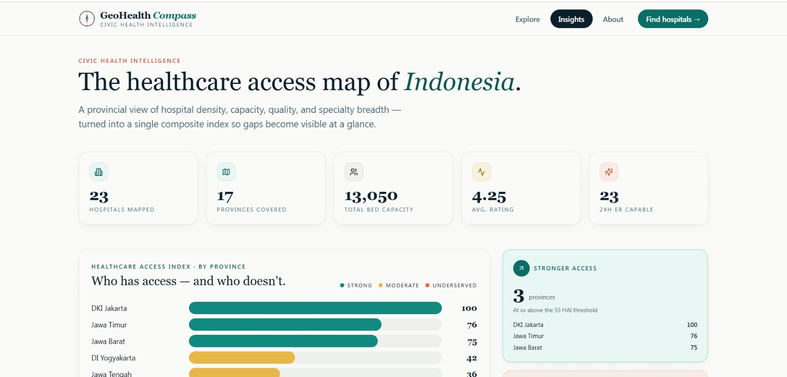

<div align="center">

# GeoHealth Compass

### Nationwide Smart Hospital Discovery & Healthcare Access Intelligence Platform

*A civic-health geospatial platform for Indonesia — finding the right hospital, and making the map of access visible.*

[](https://nextjs.org/)
[](https://fastapi.tiangolo.com/)
[](https://www.typescriptlang.org/)
[](https://tailwindcss.com/)
[](LICENSE)

</div>

---

## 1. Project Overview

**GeoHealth Compass** is a full-stack geospatial web application that serves two audiences at once:

- **To an individual user**, it is a smart hospital discovery tool — find nearby hospitals, compare them side-by-side, and get a trustworthy recommendation for your specific medical need (or emergency).
- **To the public**, it is a civic-health intelligence dashboard — visualize which regions of Indonesia have stronger healthcare access and which are underserved, so the conversation about inequality can start from evidence.

Both sides are powered by the same geospatial backbone, the same hospital dataset, and the same weighted-scoring engine.

---

## 2. Problem Statement

Two real problems, side by side:

1. **The decision problem.** When a person in Indonesia needs care — routinely or urgently — finding the right hospital is fragmented and slow. Information about specialties, distance, emergency capability, and service availability is scattered across multiple apps, websites, and word of mouth. Under time pressure, this is exactly when clarity matters most.

2. **The visibility problem.** Regional healthcare access across Indonesia is uneven in ways that most citizens never see. Provincial-level differences in hospital density, specialty breadth, and capacity are real and consequential, but they live inside reports that rarely reach the public or drive conversation.

GeoHealth Compass doesn't solve either problem alone, but it puts them on the same map — with honest methodology and a clean interface.

---

## 3. Public Value & Social Impact

- **Faster, clearer decisions** for people searching for hospitals under stress.
- **Accessibility-first design** — voice search for users who cannot or should not be typing (elderly, motor-impaired, urgent physical conditions).
- **Civic literacy** — regional healthcare patterns explained visually, without requiring domain expertise.
- **Transparency** — every recommendation shows its factor breakdown; no black-box scoring.
- **Honest scope** — the platform is explicit about what it is (decision support) and what it isn't (diagnosis, booking, triage).

---

## 4. Two-Sided Platform Concept

| | **Side 1 · Public Utility** | **Side 2 · Civic Health Intelligence** |
|---|---|---|
| **Who it's for** | Individual users, families, caregivers | Citizens, students, researchers, journalists |
| **Pages** | `/explore`, `/hospital/[id]` | `/insights` |
| **Core question** | *"Which hospital should I choose?"* | *"How fairly is care distributed across the country?"* |
| **Key outputs** | Ranked recommendations, comparison, maps | Healthcare Access Index, regional charts, gap highlights |

The same dataset powers both — a deliberate architectural choice that lets the platform feel coherent rather than stitched together.

---

## 5. Main Features

### Side 1 — Public utility
- Browser geolocation with graceful city-picker fallback
- Interactive Leaflet map with distance-sorted hospital markers
- Filters: specialty / medical need, radius, rating, emergency-only
- **Recommended hospital near you** — weighted scoring, top pick surfaced
- **Best option by specialty** — filter drives the same recommendation engine
- **Emergency-ready finder** — dedicated scoring mode prioritizing ER readiness
- **Hospital comparison drawer** — side-by-side scored view of 2–4 hospitals
- **Voice-assisted search** — Web Speech API + EN/ID keyword intent mapping
- Hospital detail pages with full specialty list, service indicators, quality score, and map

### Side 2 — Civic health intelligence
- National KPI strip (hospitals, provinces, beds, avg. rating, ER capacity)
- **Healthcare Access Index** ranking per province with tier classification (strong / moderate / underserved)
- Specialty distribution bar chart
- Capacity distribution ranking
- Underserved-area callouts with context and caveats

---

## 6. Recommendation Logic Overview

The recommendation engine is a **transparent weighted-scoring system** with two operational modes.

### Normal mode (default)

| Factor | Weight |
|---|---|
| Specialty match | **35%** |
| Distance | **30%** |
| Service completeness | **15%** |
| Rating (1.0–5.0, normalized) | **10%** |
| Healthcare access proxy | **10%** |

### Emergency mode (`emergency_only` filter)

| Factor | Weight |
|---|---|
| Emergency readiness | **40%** |
| Distance | **35%** |
| Service completeness | **15%** |
| Rating | **5%** |
| Healthcare access proxy | **5%** |

**Normalization rules** (so weights are comparable):
- Distance → linear decay from 0 km (score 1.0) to 50 km (score 0.0)
- Rating → linear map from 1.0–5.0 into 0.0–1.0
- Specialty match → 1.0 hit, 0.3 miss (0.7 when no specialty specified)
- Service completeness → share of 6 standard service indicators present
- Emergency readiness → composite of 24h ER (40%), ICU (25%), trauma (20%), ambulance (15%)
- Healthcare access proxy → bed capacity / 1500 (national reference ceiling)

Final score is rescaled to **0–100** for UI readability. Every factor's contribution is exposed in the `score_breakdown` field and rendered in the compare drawer.

---

## 7. Voice-Assisted Search Overview

A lightweight, **deterministic keyword-based intent parser** — not a chatbot, not a diagnostic assistant.

**Flow.** Microphone tap → browser Web Speech API transcribes → transcript sent to `POST /api/voice/parse` → backend returns `{specialty, emergency, wants_nearest, confidence, matched_keywords}` → frontend applies them as filters.

**Supported phrasings.** Both English and Bahasa Indonesia:

- `"Find the nearest emergency hospital"`
- `"I need a cardiology hospital near me"`
- `"Show nearby pediatric hospitals"`
- `"Cari rumah sakit jantung terdekat"`
- `"Rumah sakit UGD paling dekat"`

**Fallback.** If the browser doesn't support speech recognition (or the user denies the mic), a typed input runs through the same parser with identical behavior.

---

## 8. Tech Stack

**Frontend**
- Next.js 14 (App Router) · React 18 · TypeScript
- Tailwind CSS with a custom teal-coral civic-health palette
- Fraunces (display) + Inter Tight (body) via `next/font`
- Leaflet + React-Leaflet (CARTO Voyager tiles)
- Recharts (dashboard visualizations)
- lucide-react (icons)

**Backend**
- FastAPI (Python 3.11+)
- Pydantic v2
- Pure-Python scoring/geospatial — no heavy dependencies

**Architecture**
- Modular monolith · one frontend app, one backend app
- Backend modules cleanly separated: `hospitals`, `geolocation`, `recommendation`, `voice`, `insights`

---

## 9. Project Structure

```
geohealth-compass/
├── backend/
│   ├── app/
│   │   ├── main.py                    # FastAPI entry
│   │   ├── core/config.py
│   │   ├── data/hospitals_seed.py     # 22 hospitals across 14 provinces
│   │   └── modules/
│   │       ├── hospitals/             # list, nearby, detail, specialties
│   │       ├── geolocation/           # haversine + travel time
│   │       ├── recommendation/        # weighted scoring + compare
│   │       ├── voice/                 # EN+ID intent parser
│   │       └── insights/              # HAI + regional aggregates
│   ├── requirements.txt
│   └── README.md
│
├── frontend/
│   ├── src/
│   │   ├── app/
│   │   │   ├── page.tsx               # Landing
│   │   │   ├── explore/page.tsx       # Map + filters + voice + compare
│   │   │   ├── hospital/[id]/page.tsx # Detail
│   │   │   ├── insights/page.tsx      # Civic dashboard
│   │   │   ├── about/page.tsx         # Methodology + disclaimers
│   │   │   ├── layout.tsx
│   │   │   └── globals.css
│   │   ├── components/
│   │   │   ├── layout/   # Nav, Footer, Logo
│   │   │   ├── ui/       # Button, Card, Badge, RatingStars, SectionHeading
│   │   │   ├── hospital/ # HospitalCard, Filters, VoiceSearch, Compare, LocationBanner
│   │   │   └── map/      # HospitalMap, MapClient (dynamic wrapper)
│   │   └── lib/          # api.ts, types.ts, utils.ts
│   ├── package.json
│   ├── tailwind.config.ts
│   └── README.md
│
├── README.md
└── .gitignore
```

---

## 10. Setup Instructions

### Prerequisites

- **Node.js** 18.17+ (for Next.js 14)
- **Python** 3.11+
- **npm** or **pnpm**

### Clone

```bash
git clone https://github.com/your-username/geohealth-compass.git
cd geohealth-compass
```

### Backend

```bash
cd backend
python -m venv .venv
source .venv/bin/activate          # Windows: .venv\Scripts\activate
pip install -r requirements.txt
```

### Frontend

```bash
cd ../frontend
npm install
cp .env.local.example .env.local   # Already points to http://localhost:8000
```

---

## 11. How to Run Locally

Run backend and frontend in **two terminals**.

**Terminal 1 — Backend:**
```bash
cd backend
source .venv/bin/activate
uvicorn app.main:app --reload --port 8000
```
API docs live at `http://localhost:8000/docs`.

**Terminal 2 — Frontend:**
```bash
cd frontend
npm run dev
```
App lives at `http://localhost:3000`.

---

## 12. Geolocation-Based Hospital Discovery

On first load of `/explore`, the browser requests the user's location via the Geolocation API. If granted, coordinates are sent to `GET /api/hospitals/nearby?lat=&lng=&radius_km=`. The backend computes **haversine great-circle distances** to every hospital, filters by radius + the user's chosen filters, and returns results sorted ascending by distance.

If the user denies geolocation, the `LocationBanner` component offers a fallback: pick one of eight major Indonesian cities (Jakarta, Bandung, Surabaya, Yogyakarta, Medan, Denpasar, Makassar, Semarang). Every downstream feature works identically from there.

Travel-time estimates use a conservative 30 km/h urban average — honest about what it is (a rough proxy), never presented as live traffic data.

---

## 13. Hospital Recommendation Logic

The recommendation engine ranks candidate hospitals with a weighted composite score (see [§6](#6-recommendation-logic-overview) for the full table). The logic lives in a single, readable Python module — `backend/app/modules/recommendation/service.py` — where each factor has its own normalizer function. This structure makes it trivially easy to:

- Add a new factor (write a normalizer, add it to the weights dict)
- Change a weight (one-line edit)
- Swap in a new operational mode (e.g. "pediatric priority")

Scores are exposed with their full breakdown via `GET /api/recommendations/nearby` and `GET /api/recommendations/compare`. The compare drawer in the UI renders the breakdown as per-factor bars, so users can *see* why one hospital outranked another.

---

## 14. Healthcare Gap Insight

The insights dashboard computes a **Healthcare Access Index (HAI)** per province from four factors, each min-max normalized across provinces in the dataset and combined with the weights below:

| Factor | Weight |
|---|---|
| Hospital density (count) | 30% |
| Aggregate bed capacity | 30% |
| Average hospital rating | 20% |
| Specialty breadth | 20% |

Provinces are then classified into three tiers:

- **Strong** (HAI ≥ 55) — shown in teal
- **Moderate** (25 ≤ HAI < 55) — shown in amber
- **Underserved** (HAI < 25) — shown in coral and called out explicitly

This design is deliberately honest about its limitations: it is a **dataset-internal relative ranking**, not a per-capita access measure. Count-based factors (hospital count, bed capacity) are log-transformed before normalization so that outlier provinces don't crush the rest into "underserved". The dashboard says so.

---

## 15. Voice-Assisted Search & Accessibility Value

Voice-assisted search is implemented as an **accessibility affordance**, not a product differentiator for its own sake. The intended users are:

- **Elderly users** for whom typing on a phone is slow and error-prone
- **Users with motor impairments** where tapping small touch targets is difficult
- **Users in urgent physical conditions** — chest pain, labor, severe injury — for whom every second of cognitive overhead matters
- **Users in low-literacy or unfamiliar contexts** where natural-language speech is easier than interface navigation

The implementation is deliberately simple and deterministic: a short vocabulary mapping in `backend/app/modules/voice/service.py` covers the common ways people phrase hospital requests in English and Bahasa Indonesia, returning structured filters that the UI applies exactly the same way as manual filter selection. A typed input fallback handles the case where speech recognition is unsupported or declined.

---

## 16. Notes About Data Limitations

- The seeded dataset covers **22 hospitals across 14 Indonesian provinces**. It is *representative* of the variation in Indonesian healthcare (major public tertiary hospitals, national specialty centers, private networks, regional hospitals in less-served provinces) — but it is **not exhaustive**.
- Ratings and service indicators are **illustrative** for MVP demonstration. They follow plausible public profiles but should not be treated as authoritative quality assessments.
- Regional access scores are **normalized within the dataset**, not against province population. A production version would combine [Kemenkes RS Online](https://rsonline.kemkes.go.id/) facility data with [BPS](https://www.bps.go.id/) population statistics for a true per-capita index.
- Doctor-level availability is **intentionally out of scope**. Specialty categories and service indicators are shown; individual schedules are not.

---

## 17. Disclaimer — Availability & Medical Decision Support

> **GeoHealth Compass is an informational decision-support tool, not a clinical, diagnostic, or booking platform.**
>
> - Hospital specialties, services, and availability shown here may vary and should be **confirmed directly with the hospital** before making care decisions.
> - Ratings and service indicators are illustrative and do not constitute clinical quality assessments.
> - The platform is **not** a substitute for professional medical advice, diagnosis, or triage.
> - In a real emergency, call **118** (ambulance) or **119** (national emergency) immediately.

---

## 18. Future Improvements

Realistic next steps that would strengthen the project without breaking scope:

- **Live data ingestion** from Kemenkes RS Online with scheduled updates
- **Per-capita normalization** of the HAI using BPS population data
- **PostgreSQL + PostGIS** backing for true spatial queries at larger scale
- **Map clustering** for dense urban regions (React-Leaflet-Cluster)
- **Directions integration** using an external routing provider
- **Language toggle** for the UI (Bahasa Indonesia translation)
- **Offline-friendly PWA** for areas with intermittent connectivity
- **A11y audit** with Lighthouse + manual screen-reader testing
- **Integration tests** for the recommendation engine against known reference scenarios

---

## 19. Screenshots

*(Add screenshots here after running the project locally.)*

-   — Landing page
-   Explore page with map + filters
-   — Voice search modal
-    — Compare drawer
-  — Hospital detail page
-  — Civic insights dashboard

---

## 20. Author

**Rayhan**
Information Systems · Telkom University Jakarta
Student capstone project · 2026

---

## 21. License

MIT License · see [LICENSE](LICENSE) for details. Hospital data and indicators are illustrative and used for educational demonstration only.

---

<div align="center">

**Made as a student project, with care for the public it could one day serve.**

</div>
